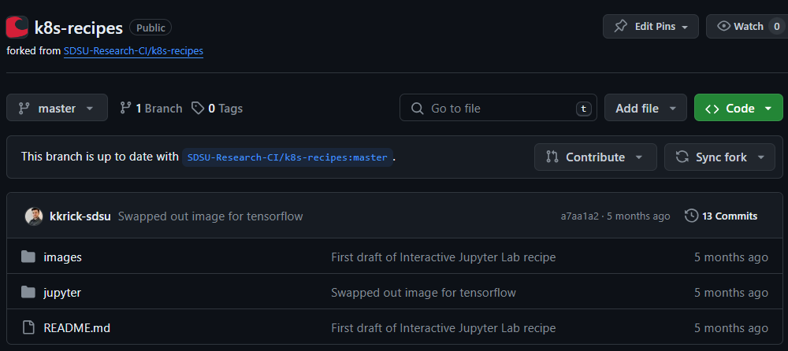

# Kubernetes (k8s) Recipes
This repository is a collection of "recipes" to accomplish specific tasks via containers run on Kubernetes-based systems.
This repo aims to increase the accessibility and usability of the compute resources available on [TIDE](https://csu-tide.github.io/) and the larger National Research Platform Nautilus.

## Context for Containers and Kubernetes
If you are not familiar with them, software containers are software applications that have been packaged with all of their dependencies which includes the operating system, runtime environment and libraries. Containers allow for isolated runtime environments, consistent & reproducible execution, and portability from desktop to cluster or cloud. Containers are like virtual machines (VMs), but smaller and optimized to the software application.

[Kubernetes](https://kubernetes.io/), often shortened to 'k8s', is a container orchestration platform that runs many containers at scale. Kubernetes manages each container's compute needs including CPUs, GPUs, memory, storage and networking. Kubernetes is like the operating system for containers. Kubernetes provides 'kubectl', a commandline tool for interacting with Kubernetes-based systems. Since Kubernetes is like the operating system, then kubectl is its commandline shell.

## Prerequisites
Before you begin using these recipes, you must have access to TIDE and be added to a namespace. 
Please follow the [instructions for getting access](https://csu-tide.github.io/containerization/gettingaccess).
The request process should require 10 minutes of your time, and should be approved within a business day by TIDE Support team.

We highly recommend following our [quickstart guide](https://csu-tide.github.io/containerization/quickstart) which will walk you through a "Hello World"-like example to give you some familiarity for working with Kubernetes via kubectl. 
This guide should require 30 minutes of your time to complete.
Should you run into any issues while following the guide, please send us an email at csu-tide-support@sdsu.edu.

The recipes in this repository assume that you have familiarity with the following:
- Linux
- Commandline
- Git

## Install Kubectl
Kubectl is the commandline tool for interacting with a Kubernetes cluster.
Please follow the [official directions for installing kubectl](https://kubernetes.io/docs/tasks/tools/#kubectl) and select your operating system.
When you come to the step "Verify kubectl configuration" you will need your kube config file.
You should have downloaded this file and followed the set up in the getting access directions under the [NRP Portal tasks](https://csu-tide.github.io/containerization/gettingaccess#nrp-portal-tasks) section.
If you did not do that, please do so prior to attempting to verify your kubectl installation.
Should you run into any issues installing kubectl, please send us an email at csu-tide-support@sdsu.edu.

## Getting the Recipes
Each of the recipes will assume that you have a copy of the recipe downloaded. Below are two options for getting copies of the recipes.

### Cloning (or Forking) this Repo
You can clone this entire repo if you would like to have a copy of all the recipes. You can then periodically perform a `git fetch` to check for updates, and you can download the updates with a `git pull`.
- *Note*: A `git pull` may conflict with your local changes. If you wish to maintain your own changes, consider [forking](https://docs.github.com/en/get-started/quickstart/fork-a-repo) this repo instead.

To clone this repo just follow these steps:
1. Via commandline, navigate to where you want to clone this repo
1. Run the following command:
    ```bash
    git clone https://github.com/csu-tide/k8s-recipes.git
    ```
1. Verify that you successfully cloned the repo with `git status`:
    ```bash
    $ git status
    On branch master
    Your branch is up to date with 'origin/master'.
    ```

### Downloading Individual Files
Just need one specific file? No problem! Just follow these steps to get one file at a time:

1. Navigate the repo directory structure to get to the file you are interested in
    - 
1. In the upper right corner of the file viewer, click "Raw"
    - 
1. Copy the URL from your browser's address bar
    - 
1. Navigate to the system that you wish to download the file to
1. Use an http client to download the file
    - Example using curl
        ```bash
        curl -O https://raw.githubusercontent.com/csu-tide/k8s-recipes/master/jupyter/jupyter-pod.yml
        ```
    - Example using wget
        ```bash
        wget https://raw.githubusercontent.com/csu-tide/k8s-recipes/master/jupyter/jupyter-pod.yml
        ```
1. Make sure that the file downloaded successfully with `ls -la`:
    ```bash
    $ ls -la
    total 88
    drwxr-xr-x  5 kkrick kkrick  4096 Oct 18 14:27 .
    drwxr-xr-x 20 kkrick kkrick  4096 Oct 11 08:10 ..
    -rw-r--r--  1 kkrick kkrick 64110 Oct 18 14:27 jupyter-pod.yml
    ```
